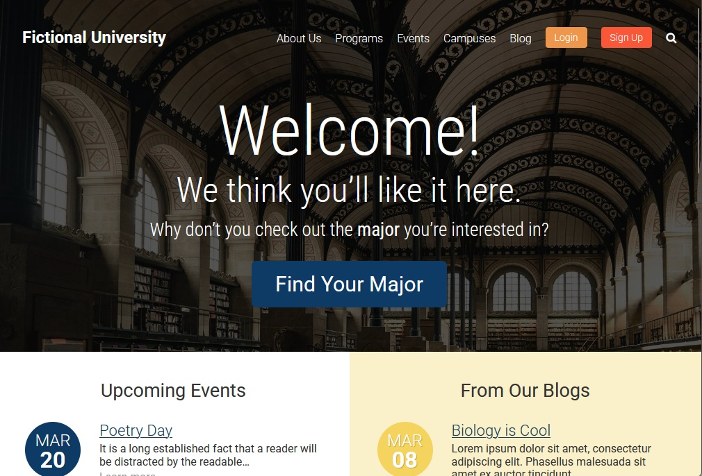
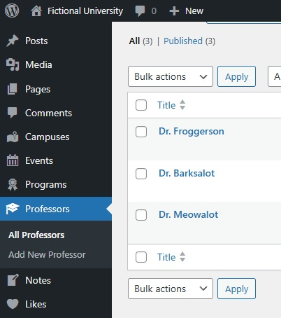
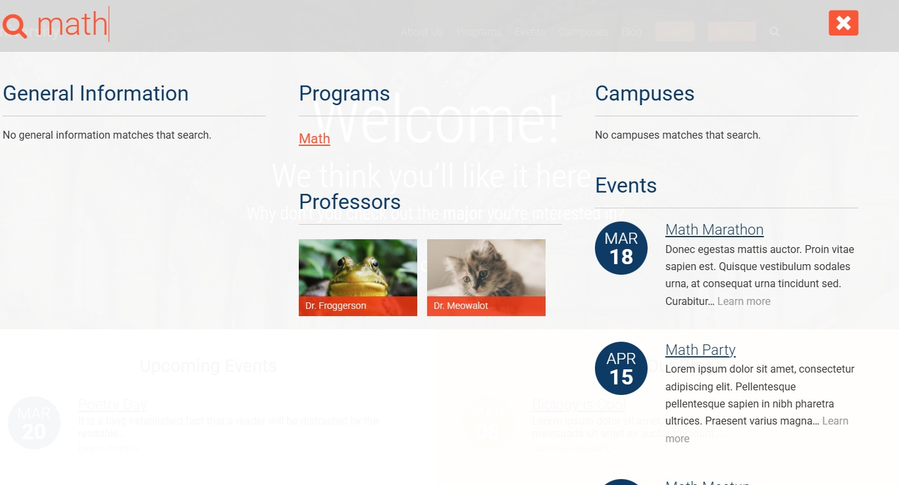
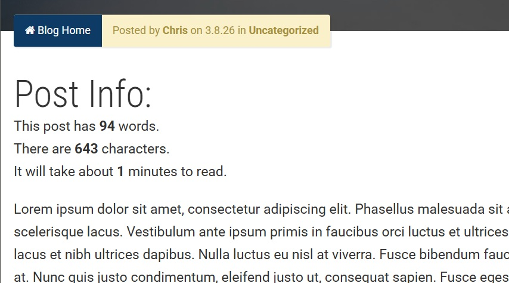
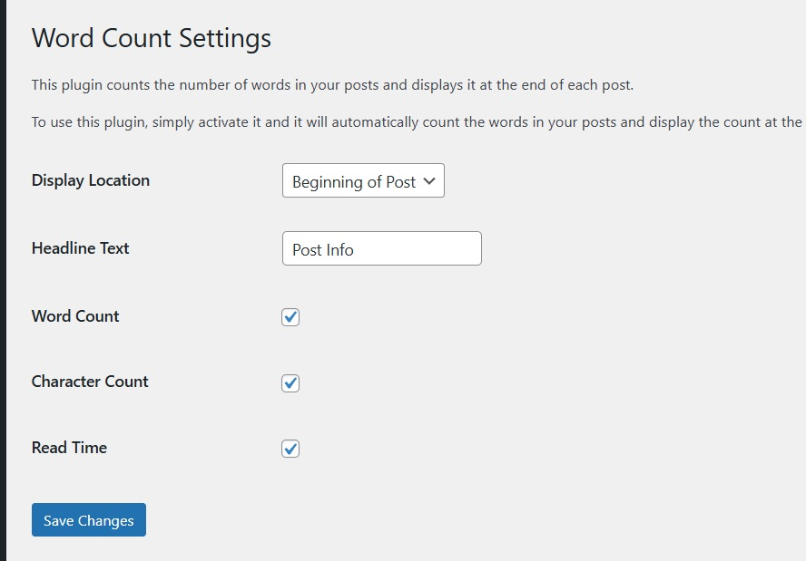
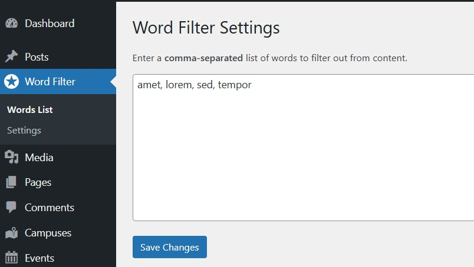
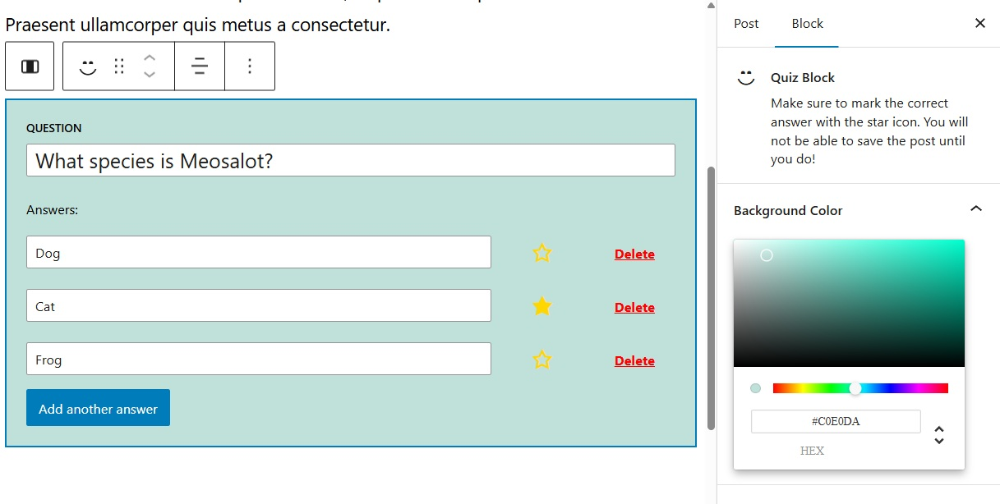
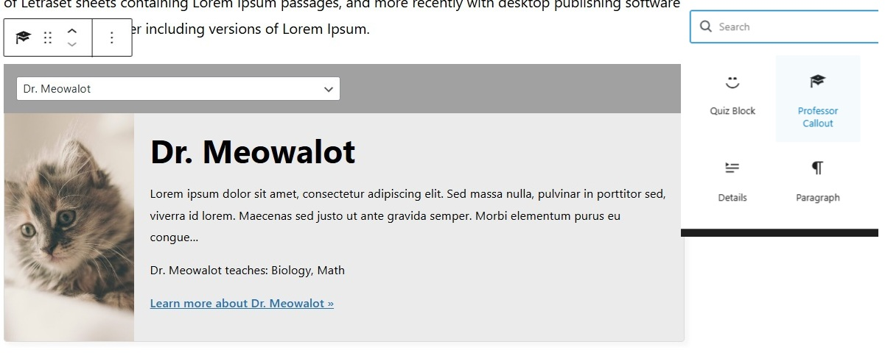
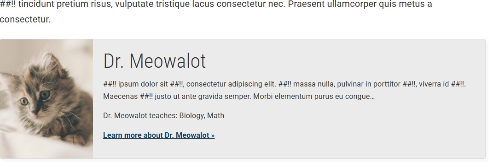

This project is a custom WordPress build created as part of my 2026 initiative to rebuild and modernize my WordPress development workflow. It includes six custom plugins, a multi‑source search system, and a user‑based “like” feature for professor profiles.

🔧 Features
Eight Custom Plugins
Each plugin was built from scratch to handle specific functionality within the site.

Custom Multi‑Source Search System
The search bar aggregates results from multiple WordPress post types:
- Departments
- Events
- Professors
- Campuses

Results are displayed in a structured, multi‑column layout, making it easy to scan content by category.
User‑Based “Like” Functionality
Signed‑in users can “like” professor profiles.
This feature includes:
- A custom REST endpoint
- User‑specific like tracking
- A clean UI indicator showing whether the user has already liked a professor
- Secure logic preventing duplicate likes
This adds an interactive, personalized element to the site and demonstrates custom database interaction within WordPress.
I also implemented a custom Word Count plugin that allows users to input text and receive a word count, as well as a Word Filter plugin that enables users to specify words they want to filter out from their content.
Logged in users can take notes that are saved to their profile. All the CRUD operations for the notes are handled through custom REST API endpoints, ensuring a seamless and secure user experience.

Multiple choice questions are implemented using custom post types, allowing for easy management and display of quiz content.
- Admin can add a quiz block to any page, which will display the multiple choice questions in an interactive format for users.

Professor profiles include a “related posts” section that dynamically pulls in content related to the professor, such as their department, events they are involved in, and other relevant information. This is achieved through custom queries and template logic.

Modern WordPress Development Practices
- Custom post types
- Custom taxonomies
- Clean plugin architecture
- Reusable components
- Secure, structured PHP and JavaScript integration

🛠️ Tech Stack
- WordPress
- PHP
- JavaScript
- JQuery
- Custom Plugins
- Custom Post Types
- Custom Search Query Logic
- Custom REST API Endpoints

📌 Purpose
This project is part of my 2026 effort to sharpen my WordPress development skills through hands‑on, real‑world builds. It focuses on:
- Plugin development
- Search architecture
- Interactive user features
- Clean, maintainable code
- Practical, functional site components
The goal is to create a fully functional, modern WordPress site that demonstrates advanced development techniques and provides a solid foundation for future projects.

📸 Screenshots

*Homepage — header with navigation, search bar, and featured content section.*

 

*Admin dashboard showing 'must use' custom plugin settings.*

 

*Search results page showing multi-column layout.*

 

*Word Count Plugin Settings.*

 

*Word Count Plugin Admin Settings.*

 

*Word Filter Plugin Admin Settings.*

 

*Adding a Quiz Block.*

 

*Quiz Block on the Frontend.*

 

*Professor Feature Admin.*

 

*Professor Feature Frontend.*
